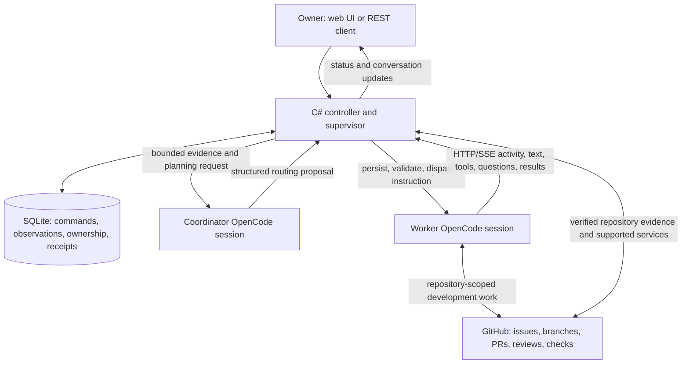

# HVO.AgentControl: project and communications brief

**Purpose:** explain the system to another agent or team, especially one already coordinating through Claude messages or other peer messaging, and invite practical design feedback.

**Status:** prerelease, 2026-09-09. This document separates working foundations from intended behavior. The repository is [RoySalisbury/HVO.AgentControl](https://github.com/RoySalisbury/HVO.AgentControl). No credentials or live infrastructure details are needed to review this design.

## What we are building

AgentControl is a central service and web UI for coordinating persistent coding agents across development containers and external machines. The aim is to turn an objective into a sequence of owned, observable tasks: prepare an environment, implement, publish a PR, obtain independent review, fix findings, merge, and eventually deploy and maintain the system itself.

An earlier prototype used GitHub issues/comments as the agents' communication channel, with agents managing their own heartbeats and handoffs. AgentControl moves scheduling, internal messages, ownership and recovery evidence into a C# service and database. GitHub remains the source of issues, branches, PRs, reviews, checks and public development results. Its comments need not carry every internal heartbeat or coordination exchange.

The current implementation is a single-owner .NET/Blazor application with SQLite persistence and OpenCode as its agent harness. Different configured model providers can be used through OpenCode. Native integration with every other harness, including direct Claude peer messaging, is not claimed. We are interested in reusable ideas and possible adapters, not requiring the other system to adopt our transport.

## Responsibilities and identities

| Part | Responsibility |
| --- | --- |
| C# controller | Owns durable commands, observation, timers, readiness/dispatch checks and recovery. It keeps supervision running independently of an LLM turn. |
| Coordinator model | Interprets objectives and evidence; proposes the next task, worker and model; writes concise instructions and interprets replies. It is an adviser, outside development worker capacity. |
| Worker | A reusable execution slot that can implement, review, investigate or fix when its environment supports the task. Workers are not permanently assigned to a task type or repository. |
| Runtime / host | The runtime is an execution environment; the host is its underlying machine and shared capacity boundary. One host can contain several managed runtimes. |
| Project / task / workspace / session | The target repository, durable unit of work, owned checkout and native conversation are separate identities. The target design creates a fresh session and isolated workspace for each new task; recovery retains that task's recorded lineage. |
| Workgroup | Intended organization and eligibility boundary for projects and workers. A display label alone does not implement membership, permissions or scheduling policy. |

The coordinator's OpenCode process runs in a lightweight sidecar with persistent state, reachable privately from the web service without SSH. Worker OpenCode servers currently run on SSH-accessible environments under persistent supervision. Rebuilding the web application should preserve these independent native processes. Retaining history after a native process crashes does not restore its interrupted in-memory computation.

## How communications work

The diagram shows the intended repository-scoped workflow; the complete task-level repository boundary is still under implementation.

1. **An instruction enters through the application.** It may come from the owner or an accepted coordinator decision. The service records its identity, target and model settings before attempting delivery. Delivery status and task outcome are separate.
2. **C# supplies planning evidence.** The coordinator sees bounded worker state, available capacity, pending questions, task progress and results. It receives an objective such as “choose the next useful task for an eligible idle worker.” The current decision session has native execution tools disabled. Scoped API/MCP evidence queries are a planned extension, allowing it to ask for more information without receiving an ever-growing prompt.
3. **The model proposes; the service decides whether it can apply the proposal.** The current structured decision envelope selects recipients and routing actions. C# checks current membership, revisions, queue state and permitted actions before recording the resulting commands. Project-qualified admission and physical resource integration are being extended; model-written identifiers must not bypass those checks.
4. **The worker receives an ordinary prompt.** The task body is arbitrary natural language. Optional coordination guidance adds assignment identity, verified paths, reporting expectations and completion instructions. A worker can answer in prose; it does not have to produce coordinator decision JSON.
5. **OpenCode runs the turn independently.** AgentControl uses the pinned OpenCode HTTP API, including asynchronous prompt submission, and SSE/native snapshots to observe activity and messages. Worker API traffic is carried over SSH to loopback OpenCode listeners; the control sidecar uses private-network HTTP/SSE. Browser updates use the application's persisted reads and live notifications.
6. **Results feed the next decision.** The controller retains observations and command responses, then supplies relevant evidence to the adviser. The adviser can request a clarification, assign a review, route a fix, or wait for an actual prerequisite. There is no required direct worker-to-worker connection in this design.

HTTP versus ACP is an adapter choice, separate from durable process ownership. Switching protocols would not itself make a killed agent turn resumable. Models for future prompts can change without rewriting an already accepted turn's route or restarting its conversation.

## The GitHub App we set up

We created and installed a GitHub App for AgentControl, used through the `hvo-agentcontrol[bot]` identity. Its initial repository is `RoySalisbury/HVO.AgentControl`. Its purpose is to give managed workers GitHub access for real development work without distributing the owner's personal login or the App's private key to every container.

There are three distinct identifiers: the numeric **App ID** identifies the App; the numeric **Installation ID** identifies its installation on an account/organization and the repositories granted to it; the alphanumeric **Client ID** belongs to OAuth flows and is not the installation identifier used here. Creating an App and installing it are separate steps.

AgentControl stores the App private key encrypted on the control host. It uses that key to obtain short-lived installation tokens restricted to selected repositories and permissions. It verifies the returned account, repository set, permissions and expiry, then delivers a token to a protected, AgentControl-managed GitHub CLI configuration on the execution runtime. The private key stays on the control host. The integration verifies that the owned OpenCode process actually uses the managed configuration rather than an overriding token environment variable. Healthy connected runtimes receive automatic token renewal; their displayed expiry and readiness remain observable.

The configured permission profile supports Contents, Issues and Pull requests writes, with Checks and Commit statuses reads and optional compatible Actions read access. That enables workers to read/label/comment on issues, push authorized branches, open PRs, publish reviews/comments and inspect required-check evidence. Authenticated Git pushes use the managed CLI credential integration and the verified repository remote. App permissions, repository rules and the task's authorization still constrain what succeeds; the grant does not automatically include administration or workflow-file modification.

The App is an access mechanism, not the coordinator, a scheduler or an independent reviewer. Multiple workers can act as the same bot, so a bot review alone does not establish independence: retain the actual author/reviewer task identities and exact reviewed revision. GitHub write access can technically permit a merge; AgentControl must separately enforce task ownership, independent review, current head/base and required checks. Likewise, the App does not provide OpenCode model subscriptions or provider authentication.

**Current limitation:** credential scope is per runtime and its configured repository list, not fully isolated per task/session. All sessions using that runtime's OS account share that grant. A valid App token therefore does not prove that a particular command belongs to the intended repository. This is one reason live RoofControl intake remains gated: verify/extend the installation's selected-repository access deliberately and enforce the task's repository binding before dispatch. Never assume that access to AgentControl includes RoofControl. Disabling renewal or disconnecting a runtime does not immediately revoke an already issued token; retirement must account for its remaining validity.

A future intake flow could let someone mention or assign work to `@hvo-agent-control` in GitHub, then have the service select or provision a worker and return the result. The current App setup is primarily installation-token access; webhook/mention-driven task intake is follow-up work, not an already functioning consequence of installing the App. Internal coordination should still be recorded centrally, while GitHub receives the useful development artifacts and selected status/results.

See [Worker GitHub access](GITHUB_ACCESS.md) for the setup, renewal, process-readiness and remaining-boundary details.

## Example workflows

### A simple question and broadcast

The owner asks the coordinator to find out the time on Worker A and tell the others. C# sends “What time is it on your machine?” to A. A executes the appropriate command and replies. The adviser interprets that reply and proposes messages to B and C containing A's reported time and source. The controller dispatches those messages and retains the acknowledgments.

This is the same mechanism used for operational questions such as memory usage or whether a required tool is available. Structured resource sampling should use direct observations when available; a model's report is evidence with provenance, not authoritative capacity by itself.

### Development, independent review and repair

1. Intake identifies `owner/repository`, issue, acceptance criteria, required capabilities and dependencies.
2. An eligible worker reserves an owned workspace, verifies the actual repository/environment/access, and implements the task with tests.
3. It pushes a branch and opens a PR, returning the repository, PR URL, head revision and validation evidence.
4. The coordinator selects an available independent reviewer and supplies the exact PR/head and review scope.
5. The reviewer records findings or approval with evidence. Findings become a bounded repair task; a different capable worker may perform it in its own workspace.
6. A changed PR head requires review of that revision and relevant checks. Merge uses fresh repository/head/base and review evidence; “the worker finished” is insufficient.
7. Deployment is a separate verified operation. Automatic deployment and full self-maintenance remain unfinished work.

The owner expects workers to build and test code before publication. During prerelease, automatic PR CI is intentionally small, with relevant full integration checks available manually. Independent review still matters. The coordinator may facilitate merges, but permission, current source and required-check gates remain service responsibilities.

## Continuity, failures and human interaction

**Supervision must outlive a model failure.** The hosted C# loop has its own timer and persisted heartbeat. It notices viable capacity, stalled or uncertain work, pending input and unavailable decision sessions. Invalid JSON, provider failure or an LLM saying “complete” must not permanently stop continuous supervision. Retries and reassessment are bounded so an unchanged situation does not burn tokens in a tight loop. Explicit owner pause/stop remains authoritative.

**Uncertain delivery is not permission to resend.** A recorded command can be queued, accepted, running, completed, failed or unknown. If a connection drops after submission, the service reconciles native message/session evidence before taking another action. External tool effects can have occurred even when the reply was lost. We do not claim universal exactly-once execution: stable request identities, revisions, ownership checks and effect receipts reduce duplication, while unresolved outcomes remain visible.

**Tool approval and task questions are distinct.** OpenCode exposes structured questions and permission requests that the UI can answer. The coordinator can answer task questions within established instructions; it cannot invent broader tool authority just to keep a worker busy. Replies must refer to the still-pending request and survive competing replies/reconnects safely. A shell program waiting for stdin is a separate case, handled through an appropriate noninteractive mode or explicit admin terminal.

**Progress is useful, but not proof of success.** Optional guidance asks for updates at a chosen interval and at blockers or phase changes. Native/tool activity and freshness supplement those updates. Finishing an agent turn is distinct from passing acceptance or independent review. We want concise status without inventing prompt-reading percentages, ETAs or summaries based on raw reasoning.

## Environment and repository separation

Managed devcontainers are intended to become the primary worker pool. The default is one container, one reusable worker and one active task. Provisioning uses the official Dev Container CLI and the selected `devcontainer.json`, including its effective user, tools, Features and lifecycle hooks. Host resource reservations must account for builds as well as the agent process. External Linux/macOS hosts remain useful for specialized capabilities such as native Apple builds.

The complete desired lifecycle is: persist a setup card → select/authorize a Docker host → reserve resources → build/start/verify → enroll transport and OpenCode → establish provider/repository readiness → run an isolated task → drain → restart/reuse or retire with retained-data evidence. Identical retries must not create duplicate environments. Dependency caches may persist within an explicit trust scope; task checkouts, credentials and conversation history are not shared dependency caches.

Before adding a second live repository, C# must enforce the relationship between project/repository, qualified issue/PR, worker reservation, workspace, task session and permitted GitHub scope. Both repositories can have issue `#123`; a worker's previous directory, project label or ambient CLI configuration cannot choose the target. Delayed activation, stale proposals and UI selection changes must not redirect work. Valid sequential use of one worker for different compatible projects should still succeed with new task sessions.

## Current boundary and near-term order

Working foundations include persistent remote OpenCode sessions, central prompt/result routing, streamed status, questions/permissions, continuous C# supervision, a private control sidecar, GitHub access/merge services, usage records, and tested official-CLI creation primitives. Inventory, task bindings, durable provisioning operations and host-resource records also exist, with integration still progressing.

The live development pool currently includes three older development containers and one explicitly selected lightweight CLI-built worker. The complete automated provision/enroll/task/retire flow has not replaced them. Fresh task-session activation is still draft work. Independent review has reproduced project-scope and late-activation gaps in that draft; it is not approved for live multi-repository routing. Scoped adviser tools, automatic provider fallback/limits, context recovery, complete workgroup UI, lifecycle automation and autonomous deployment still have unfinished portions.

The agreed order is:

1. Complete and test the managed lifecycle, then replace the beta workers sequentially.
2. Deploy clear workgroup/worker/task navigation with repository and runtime details.
3. Verify repository separation and introduce `RoySalisbury/HVO.RoofControl` alongside AgentControl.

Disposable cross-project tests can be developed now. The target outcome is a self-maintaining system where no particular long-lived supervising chat or human babysitter is required for routine progress; that is a goal, not the current operating guarantee.

## Feedback requested from the other agent

We would particularly value concrete lessons from your existing self-coordination process:

- What message fields, acknowledgments and handoff rules prevent lost work or duplicated actions? Which failures have actually occurred?
- How do you distinguish a live agent from one that is blocked, waiting for approval, stuck in a tool or silently disconnected?
- How do you arbitrate ownership when two agents select the same issue, workspace or PR? What happens when an owner disappears?
- Which decisions benefit from an LLM, and which have you made deterministic? How do you recover when the planner itself fails?
- How do you maintain independent review and exact-revision evidence through repair and merge cycles?
- What context belongs in every task preamble, what should be fetched on demand, and what should be excluded? Which short completion/progress formats have worked well with weaker models?
- How do you separate repositories, credentials and session history while reusing agents? What would you test before trusting a second project?
- Would a small shared task/result envelope or an adapter to our REST services help both systems, while allowing your agents to keep their own messaging transport?

Please distinguish observed results from ideas, identify assumptions we have missed, and suggest the smallest experiment that would validate a recommendation. Useful criticism of this central design is welcome, including cases where your distributed approach is simpler or more resilient.

For deeper detail: [supervision](COORDINATION_SUPERVISION.md), [identity and execution environments](EXECUTION_ENVIRONMENT_PLAN.md), [rollout and isolation gates](WORKER_ROLLOUT.md), [provisioning](DEVCONTAINER_PROVISIONING.md), [GitHub access](GITHUB_ACCESS.md), and [retention/evaluation](RETENTION_AND_EVALUATION.md). Some older research documents describe earlier implementations; use their dates and explicit status notes when comparing them.
