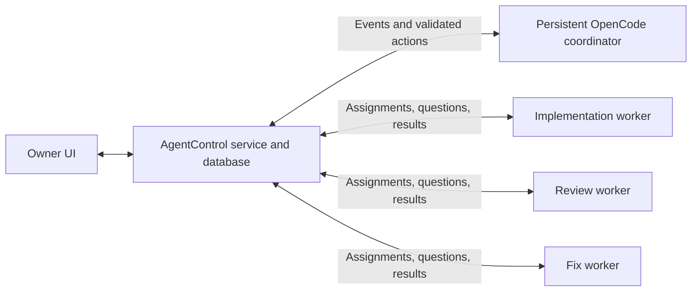

# Worker lifecycle and persistent coordination

Research date: 2026-09-07. Status: research/design record. Worker editing, archive/restore, structured requests, and the initial coordinator loop are now implemented; see [current behavior and limits](COORDINATION.md).

## Product direction

The owner wants editable workers, model changes within existing conversations, a way to retire workers, and a persistent OpenCode coordinator belonging to AgentControl. The coordinator should receive results, decide the next assignment, and drive workflows such as implementation → PR review → fixes → review. Treat coordination as a planned product capability, rather than leaving it indefinitely deferred after the initial manual-control release. Manual operation must still work when the coordinator is unavailable.

## Findings

### Model changes do not require restarting OpenCode

AgentControl already sends `model.providerID` and `model.modelID` with each `prompt_async` request using the worker's existing `NativeSessionId`. `PromptInput` accepts optional model overrides, but there is no worker update/archive endpoint or corresponding editing UI. `OpenCodeClient.Models` currently reduces discovery to provider/model IDs and a name, discarding richer options. These are application gaps.

The checked-in 1.18.29 OpenAPI snapshot permits `model`, `agent`, and `variant` on `prompt_async`. Upstream's pinned implementation starts the asynchronous prompt in a server-owned scope and returns a no-content response. An accepted turn is not kept alive by the browser's HTTP connection. This is source evidence, not a new live disconnect experiment. [Pinned HTTP implementation](https://github.com/anomalyco/opencode/blob/16747470f976aca3d362ad730bcd3fe82ecc2c9a/packages/opencode/src/server/routes/instance/httpapi/handlers/session.ts#L310), [HTTP API documentation](https://opencode.ai/docs/server/).

Changing the model for a subsequent prompt keeps the conversation identity; it does not retroactively change a model call already running. The next model receives the conversation context OpenCode constructs, subject to its context limits and compaction. This does not guarantee identical reasoning or behavior across models.

### ACP is useful, but is not a persistence fix

OpenCode ACP uses JSON-RPC over a subprocess's standard input/output. In 1.18.29, the ACP command starts an HTTP server internally, constructs an OpenCode SDK client, and waits on stdin. Its service translates model/mode/effort choices into session state and passes those selections into SDK prompts. `loadSession` fetches the saved session and messages and replays history. It does not resurrect a killed in-memory turn. [Pinned ACP command](https://github.com/anomalyco/opencode/blob/16747470f976aca3d362ad730bcd3fe82ecc2c9a/packages/opencode/src/cli/cmd/acp.ts), [Pinned ACP service](https://github.com/anomalyco/opencode/blob/16747470f976aca3d362ad730bcd3fe82ecc2c9a/packages/opencode/src/acp/service.ts).

ACP advertises configuration options and supports `session/set_config_option`; model, mode, and reasoning controls can be rendered from that metadata. This is a useful interoperability feature, but it makes no promise that a subprocess outlives its owner. A remote ACP integration would need a persistent broker that owns the process, maintains protocol state, and handles reconnection. [ACP configuration contract](https://agentclientprotocol.com/protocol/v1/session-config-options), [OpenCode ACP documentation](https://opencode.ai/docs/acp/).

For this project's current HTTP transport, closing a page or disposing SSH forwarding does not call the separate `StopOwnedServer` operation. The remote tmux-owned server is intended to survive. Stopping that server/container is different: history can survive while active computation is interrupted. Keep those operations distinct in the UI.

### What T3 Code does

Inspected T3 Code commit `d3d4ea42ee569f20d8a79562974355f659dc46d9` from its main branch; implementation details below are tied to that revision.

- Its OpenCode adapter uses the HTTP SDK's `session.promptAsync`, sending the existing session ID, selected model, agent, and variant. A persisted resume cursor retains the native session ID. T3 is not using ACP for this OpenCode integration. [OpenCode adapter](https://github.com/pingdotgg/t3code/blob/d3d4ea42ee569f20d8a79562974355f659dc46d9/apps/server/src/provider/Layers/OpenCodeAdapter.ts#L3211).
- The model picker is an ordinary web popover backed by provider/model catalogs. Selection updates the composer's model choice. The UI and server enforce provider restrictions, including `requiresNewThreadForModelChange` and continuation compatibility. Switching OpenCode model vendors within a native OpenCode session is distinct from switching the entire agent harness. [Picker](https://github.com/pingdotgg/t3code/blob/d3d4ea42ee569f20d8a79562974355f659dc46d9/apps/web/src/components/chat/ProviderModelPicker.tsx), [Selection handler](https://github.com/pingdotgg/t3code/blob/d3d4ea42ee569f20d8a79562974355f659dc46d9/apps/web/src/components/ChatView.tsx#L7409), [Server enforcement](https://github.com/pingdotgg/t3code/blob/d3d4ea42ee569f20d8a79562974355f659dc46d9/apps/server/src/orchestration/Layers/ProviderCommandReactor.ts#L540).
- Its OpenCode provider builds Reasoning and Agent option descriptors from model variants and primary agents. It also synthesizes fallback reasoning options when none are advertised. AgentControl should prefer verified capabilities rather than assume those fallback levels work for every model. [Provider options](https://github.com/pingdotgg/t3code/blob/d3d4ea42ee569f20d8a79562974355f659dc46d9/apps/server/src/provider/Layers/OpenCodeProvider.ts#L201).
- Archive, unarchive, delete, and session-stop are separate orchestration concepts. Its OpenCode adapter also contains explicit abort/teardown paths; persistence of history must not be confused with continuing active execution through every kind of shutdown. [Lifecycle decisions](https://github.com/pingdotgg/t3code/blob/d3d4ea42ee569f20d8a79562974355f659dc46d9/apps/server/src/orchestration/decider.ts#L370), [Server ownership](https://github.com/pingdotgg/t3code/blob/d3d4ea42ee569f20d8a79562974355f659dc46d9/apps/server/src/provider/OpenCodeServerOwner.ts).
- T3's adapter treats a prompt submitted during an active turn as steering. AgentControl currently deliberately waits for native idle. Do not copy that behavior without testing the exact pinned OpenCode version's tool execution, permissions, cancellation, and delivery semantics.

## Interactive questions and tool approvals

The owner's follow-up explicitly includes TUI-style questions and “approve tools” prompts. These must be actionable web controls, not transcript text requiring the owner to open a terminal.

The pinned HTTP schema exposes `GET /permission`, `POST /permission/{requestID}/reply`, `GET /question`, and question reply/reject routes. AgentControl already fetches pending requests per native session, persists them, and rechecks that a request is still pending before dispatching a response. Overview has Allow once, Allow remembered scope, Reject, and question answer/decline controls. However, permissions are displayed as raw JSON and question options as text next to a textarea. Replace those with clear tool/command/scope summaries and actual single-choice, multiple-choice, and custom-answer controls. Add a fleet-wide pending-input inbox so a blocked worker is visible even when another conversation is selected.

T3's OpenCode adapter handles `permission.asked` and `question.asked`, turns them into structured UI requests, and sends native permission/question replies over HTTP. OpenCode's ACP permission adapter also translates a native permission event to the client's `requestPermission` and sends the decision back through the SDK. ACP is another presentation/protocol path to the underlying request, not a prerequisite for approval support. [T3 request handling](https://github.com/pingdotgg/t3code/blob/d3d4ea42ee569f20d8a79562974355f659dc46d9/apps/server/src/provider/Layers/OpenCodeAdapter.ts), [OpenCode ACP permission bridge](https://github.com/anomalyco/opencode/blob/16747470f976aca3d362ad730bcd3fe82ecc2c9a/packages/opencode/src/acp/permission.ts).

Route established task questions to the coordinator when configured. Route permission requests through the owner's configured permission policy; the coordinator must not infer a broader grant from its assignment to keep workers busy. Show actor, exact requested scope, decision, and acknowledgement. A browser close leaves the native request waiting; reopening must rediscover it. A server restart can invalidate the native request, so retain its audit record but never replay a stale approval automatically. Serialize competing replies from owner/coordinator/browser tabs against the same request ID.

Distinguish these native agent requests from an arbitrary shell program waiting on stdin, an OAuth browser flow, or a curses UI. Such programs are not automatically converted into OpenCode questions by HTTP or ACP. Prefer an available noninteractive command mode, otherwise provide a separate explicit terminal/manual-action path and mark the assignment blocked until it is resolved.

Acceptance coverage must include allow once, remembered scope, reject, single/multiple/custom answers, reconnect while waiting, a request resolved elsewhere, an ambiguous reply response, and competing replies. No new live approval interaction was performed for this research.

## Recommended worker behavior

| Action | Intended behavior |
| --- | --- |
| Edit worker | Update name, role/description, and default model/options with revision checks; preserve runtime, workspace, and native session identity. |
| Change model while idle | Save the choice and use it for the next submitted turn in the same conversation. No reload or process restart. |
| Change model while busy | Let the current turn finish. Label the selected value as applying to the next submission. Show the actual active model separately. |
| Queue instruction | Capture model, agent, and variant when accepted into the queue; later edits must not silently alter an already accepted assignment. |
| Reopen conversation | Reload history/status and resume observing the saved native session. Never silently create a replacement session when it is missing. |
| Archive worker | Stop accepting new assignments; require idle and resolved pending work, or explicitly schedule archive after completion. Hide from the default list; retain history and allow restore. |
| Delete worker | Separate explicit cleanup operation with idle/queue checks. Specify whether only the control record or also native history is removed. Never implicitly delete the worktree/repository. |
| Stop active work | Explicit cancellation, followed by reconciliation of observed native idle; independent of editing or closing UI. |

Keep workspace claims while archived unless an explicit retirement operation proves work is idle and releases ownership. Restoring a retired worker must reacquire that claim before dispatch. Unknown delivery, unanswered requests, stale state, and queued instructions need visible resolution before retirement. Changing runtime/workspace is a separate migration/new-worker workflow.

## Persistent coordinator design

Run a dedicated OpenCode coordinator service alongside the AgentControl web container, with its own persistent home/config/auth/workspace and conversation state. Keep it independent of browser and web-container restarts. AgentControl stores its session identity and reconnects. Do not share the coordinator workspace with coding workers.



The model plans, interprets results, chooses an eligible worker, and writes concise assignments. Software stores workflow state, routes messages, enforces dependencies, tracks acknowledgements, handles retries, and wakes the coordinator. The OpenCode process stays available; it need not continuously generate tokens or poll its own inbox.

### General prompt dispatch

The owner clarified that coordinator-to-worker instructions are arbitrary natural-language tasks, not a catalog of predefined operations. The same dispatch path must support “report your memory usage” and a multi-step assignment to label a PR, review its changes, publish findings, and return a completion reference. AgentControl does not need a dedicated memory-inspection, PR-label, or code-review endpoint for each task. The worker interprets the prompt and uses its native tools and available credentials within its configured permissions.

The core operation is `send_prompt(worker_id, prompt, request_id)` with optional scheduling and model settings. It targets the worker's existing native conversation. A transport envelope supplies correlation and delivery tracking without constraining the task text or requiring a rigid worker-response schema. Prompts can include context, instructions, completion criteria, and a requested response format. Store the full response and expose it to the coordinator; evidence extraction and interpretation must not discard the original text.

For example, an assignment can say:

```text
In repository OWNER/REPO, apply the label "acquired" to PR #1234.
Review the PR changes against its base branch and publish your findings
as a PR comment. Include the reviewed head SHA in the comment.
After the comment is successfully posted, respond to this request with:
"Review complete for PR #1234, comment #<actual comment ID>".
If any step is blocked or fails, report that instead of claiming completion.
```

The completion line is a task-requested format, not a hard-coded protocol command. AgentControl associates the native response with the dispatched request; the coordinator can interpret it, inspect referenced evidence when needed, and formulate any next prompt. Acknowledgement, tool-permission requests, clarification questions, and final responses remain distinct. Prompting a worker to inspect memory is itself an ordinary agent turn, not a special telemetry channel.

When a worker is busy, accept the prompt into a durable queue for its next turn. Do not imply immediate interruption or steering unless that behavior is separately supported and verified. Keep arbitrary task content independent of this delivery rule. On an ambiguous delivery, reconcile the original request rather than blindly repeating side effects such as posting a PR comment.

Give the coordinator authenticated control tools, such as `list_workers`, `get_assignment`, `get_evidence`, `send_prompt`, `answer_task_question`, and `report_blocker`, through an AgentControl tool/MCP endpoint. These tools constrain routing and control-plane access, not the range of tasks a prompt may describe. A worker's ordinary native response is sufficient to report a result; an optional reporting tool can add structured evidence against its assignment. These are proposed tools, not existing integrations. Distinguish ordinary task answers from tool-permission grants.

Each assignment/report needs a durable ID, workflow ID, sender, recipient, causal event, expected worker revision, and evidence references. Separate command acceptance, native message observation, worker acknowledgement, reported completion, and verified completion. Deliver through a transactional outbox/inbox with deduplication and reconciliation; do not claim exactly-once execution of remote side effects.

Example workflow:

1. Implementation worker reports a PR URL, repository identity, branch, exact head SHA, summary, and test evidence.
2. The coordinator assigns the review worker that exact PR revision, with review scope and completion criteria.
3. The review worker acknowledges and reports findings with file/line references and any review-comment URL.
4. The coordinator assigns the fix worker actionable findings and the expected base/head revision.
5. A new push triggers review of the new SHA. Results for an older SHA remain historical evidence, not approval of the new revision.
6. Completion requires the workflow's configured review/check criteria. A stale decision, missing worker, or unresolved blocker produces a visible state and a bounded retry/escalation.

Use event batches and short evidence summaries to keep prompts concise, with detailed transcripts available on demand. Persist coordinator input, output, action IDs, and event cursor. After a restart or ambiguous response, reconcile recorded actions before invoking or dispatching again. Enforce one active coordinator turn per workflow, worker capacity, and a review/fix iteration limit. Wake it for meaningful results, questions, blockers, and deadlines rather than every token event.

## Implementation order and acceptance evidence

1. Worker update/archive/restore APIs and UI, richer model options, structured approval/question controls, and immutable per-assignment settings. Verify changing model preserves native session/history and does not interrupt the current turn.
2. Isolated lifecycle tests: close browser during work, reconnect transport, restart only the web controller, restore an archived worker, and distinguish a stopped OpenCode process from a disconnected client. Do not interrupt the owner's demo to run these tests.
3. Persistent coordinator service and session, durable workflow inbox/outbox, scoped tools, and an observable decision log. Preserve manual operation during coordinator outages.
4. Exercise implementation → review → fix → re-review with duplicate events, lost acknowledgements, stale PR revisions, unavailable workers, and coordinator restarts. Verify no duplicate dispatch and no stale approval.

The demo coordinator now uses discovered `opencode/big-pickle` in its own runtime without copied worker provider credentials. The owner also considers free/local Ollama models suitable; no Ollama endpoint was supplied. Model quality is evaluated against actual routing tasks rather than assuming a top-end model is required.

Research involved local source/schema inspection and upstream source/documentation review. No new model inference, live session interruption, ACP disconnect test, worker edit, or coordinator deployment was performed.
